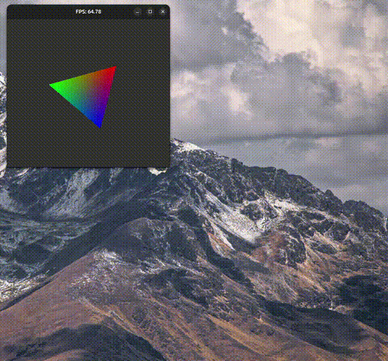

# Xlib + Vulkan 1.0

For Ubuntu 22.04.

Build shaders:
```sh
glslangValidator -V triangle.vert -o triangle.vert.spv

glslangValidator -V triangle.frag -o triangle.frag.spv
```

Build:
```sh
gcc -O3 -o triangle main.c engine.c -lvulkan -lm -lSDL2

gcc -g3 -Wall -Wextra -Wdouble-promotion -fsanitize=undefined -o triangle main.c engine.c -lvulkan -lm -lSDL2
```

Run:
```sh
./triangle
```

Result (note high FPS rates come from new vacant images present for vsync triple buffering):


